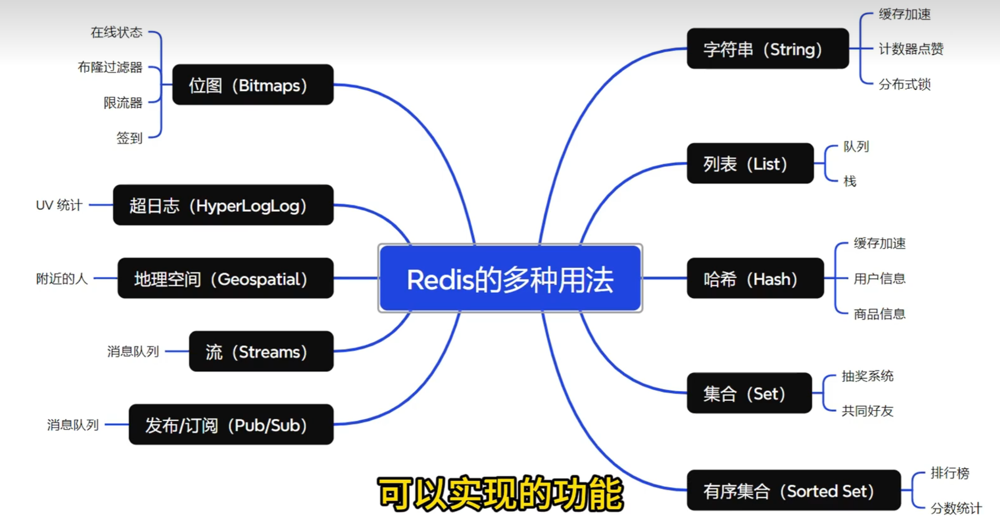

### redis出现缓存与数据库不一致问题怎么解决？
    1、延迟双删策略
       1、先删除缓存
       2、再写数据库
       3、休眠一会
       4、再次删除缓存
    2、队列式删除策略
        1、先在数据库中进行更新
        2、删除缓存
        3、删除失败把删除的缓存放到mq
        4、消费者消费mq的消息，再删除缓存
        保证了最终一致性
    
    3、订阅缓存的binlog日志，获得通知，再删除缓存
        业务客户端更新数据库
        数据库会将操作写入binlog日志
        非业务客户端订阅程序提取出所需要的数据
        再次删除缓存并实施队列删除策略

    canal框架实现mysql对binlog的订阅

### redis的过期策略和内存淘汰策略
    1、惰性删除
         客户端访问key时，去判断key是否设置了过期时间，如果设置了过期时间，则判断是否过期，如果过期则删除
        节省cpu资源，但是浪费内存资源，大量的过期的key没有被访问并不会删除
    2、定期删除
        redis每隔一段时间随机循环遍历检查过期的key，删除过期的key
    两种同时使用：
        如果去查全部的key 会导致cpu负载高
        定期去随机抽取一部分的key进行检查，删除过期的key，同时也采用惰性删除，使一些key不会占用
        如果定期删除没有检查出过期的key，且惰性删除也没有删除过期的key，则就会导致内存不够内存溢出。
    3、内存淘汰策略：
        内存淘汰策略允许redis在内存资源紧张时，主动删除一些key，从而保证redis的正常运
        noeviction 不淘汰策略：
            内存不足以容纳写入新的数据时，新写入数据会报错
        volatile-lru 最近少使用
            从设置了过期时间的key中，挑选少量使用的key进行删除
        volatile-ttl 优先将要过期的
            从设置了过期时间的key中，优先选择将要过期的key进行删除
        volatile-random 随机删除
            从设置了过期的时间key中，随机选择一些key进行删除
        allkeys-lru 全局最近少使用
            从redis所有的key中，选择最近少量使用的key进行删除
        allkeys-random  全局随机删除
            从redis所有的key中，随机选择一些key进行删除

### redis的哨兵机制
     redis部署有主从模式，主从模式下，主节点负责读写，从节点负责同步数据并提供读服务
        如果主节点挂掉，手工从从节点里选一个主节点，充当集群的主节点
        哨兵机制是redis的高可用放案
            哨兵机制是redis集群的一个子系统
            是一个独立的进程，监控redis的主节点和从节点，当主节点挂掉时，从从节点里选一个从节点充当主节点
            1、判断一个主节点是否宕机，一个哨兵节点每隔一段时间像主节点发送ping，如果超时未回复则改哨兵节点认定该主节点宕机并标记，并向其他哨兵节点发送该主节点宕机消息并询问是否同意宕机
            如果其他节点也同意，则哨兵集群认定该主节点宕机。
            2、哨兵之间开始选举一个哨兵节点作为领导者，由领导者选举从节点作为主节点。发现宕机之后，向其他节点发送请求是否同意该节点下线并选举本节点为领导节点
                如果其他节点同意，则同意该节点下线并选举本节点为领导节点
            3、哨兵领导节点则选举从节点为主节点，
                剔除不满足条件的从节点；
                1、宕机的从节点，2、超时未回复的从节点，3、与主节点断连并超时的从节点。
                选择节点条件：
                    1、优先级高的节点
                    2、同步数据偏移量大的节点
                    3、runid小的节点
            如果原主节点上线之后，则变成从节点，
### redis缓存击穿、缓存雪崩、缓存穿透
    1、缓存击穿：
        高并发场景，一个key失效，大量请求直接请求数据库，数据库压力大增；
        解决：
            1、设置永不过期时间
            2、添加互斥锁（redis分布式锁）
    2、缓存雪崩
        大量的key同时失效，导致请求到mysql。
        解决：
    3、缓存穿透
        大量的请求查询一个不存在的key，导致请求到mysql。
        解决：
            缓存空对象，设置合理过期时间
            布隆过滤
            增强id复杂度
            做好数据校验

### redis-rdb 与 aof 持久化机制
    rdb 内存快照  默认开启
        指定的时间间隔内将内存中的数据集快照写入磁盘，内存数据是二进制序列化形式，每次都从redis生成一个快照进行数据全量备份
        优点：
            1、性能高，恢复数据块
            2、文件紧凑，文件体积小
        缺点：
            1、数据丢失，reids宕机会丢失最近一次rdb之后的数据
            
    aof 日志记录
        以日志的形式记录每个写操作，将redis执行过的所有写指令记录下来（读操作不记录），在redis重启的时候会读取这些日志将写指令从前到后执行一次以完成数据的恢复工作
        优点；
            1、数据更加可靠，aof记录了每个写命令的操作，可以通过重新执行aof文件来恢复数据
            2、可以保留写命令历史，
        缺点:
            1、文件体积大
            2、性能低，恢复速度慢
    混合持久化
        rdb与aof混合持久化，redis4.0之后默认开启
        混合持久化是将rdb文件的内容和增量的aof修改内存数据的命令写入到一个新的aof文件中，新的aof文件的体积小于rdb文件和增量aof文件的体积之和。
        aof保存写，重写以rdb保存
### redis的六种分布式锁
    什么是分布式锁？
        分布式锁是控制分布式系统之间同步访问共享资源的一种方
        分布式锁的特征：
            互斥性；只能有一个客户端持有
            锁超时释放
            可重入:一个线程获取锁之后，再次获取锁，不会被阻塞
            高性能和高可用：加锁和解锁的开销要小
            安全性：锁只能被持有该锁的客户端删除，不能被其他客户端删除
    1、setnx + expire
        1、setnx 加锁
        2、expire 设置过期时间
        3、del 释放锁
        setnx(key,value) == 1 加锁成功
        expire(key,expire) 设置过期时间
        del(key) 释放锁
        问题：
            1、setnx 加锁，expire 设置过期时间，两个操作不是原子性的，可能会导致锁过期，但是没有加锁成功 反之亦可
            2、del 释放锁，可能会导致释放其他客户端的锁
    2、setnx + value(当前时间+过期时间)
        1、setnx 加锁
        2、set(key,value) 设置过期时间
        3、get(key) 获取过期时间 ，与当前时间比对时间
        4、getSet(key,value) 获取旧值，设置新值
        5、del 释放锁
        问题：
            1、过期时间是客户端自己的时间，需要保证分布式环境的时间统一
            2、没有保存持有者唯一标识，可以被其他客户端释放
            3、多线程，锁过期getset则会导致过期时间被其他客户端覆盖  
    3、lua脚本(setnx + expire)
        使用lua脚本保证setnx + expire的原子性
    4、set ex px nx
        set key value ex px nx xxx
        1、ex 过期时间 单位s
        2、px 过期时间单位ms
        3、nx 不存在则加锁
        4、xx 存在则加锁
        问题：
            1、锁过期，但是业务未执行完
            2、锁被其他客户端误删；a锁过期，但是a业务未执行完，锁被b线程获取，a业务执行完，b线程释放锁，导致b锁误删 
        解决：给vlue设置唯一标识，释放锁时判断是否是自己的锁，使用lua脚本保证原子性
    5、redisson
        redisson是一个在redis基础上实现的java驻内存数据网格，提供了一系列分布式的java常用对象，方便开发者对redis进行操作
        1、redissonLock
            1、加锁
                redissonLock.lock()
            2、释放锁
                redissonLock.unlock()
            3、看门狗机制
                看门狗机制是在加锁时，会启动一个定时任务，每隔一段时间会检查锁是否过期，如果过期则会自动续期
    6、redlock+redis
        redlock是redis官方推荐的分布式锁算法，是多个redis实例之间的分布式锁
        1、加锁
            1、获取当前时间
            2、依次向每个redis实例发送加锁请求
            3、如果超过半数的redis实例加锁成功，则加锁成功
            4、如果超过半数的redis实例加锁失败，则加锁失败
        2、释放锁
            1、依次向每个redis实例发送释放锁请求
            2、如果超过半数的redis实例释放锁成功，则释放锁成功
            3、如果超过半数的redis实例释放锁失败，则释放锁失败
        3、看门狗机制
            1、加锁时，每个redis实例都会启动一个定时任务，每隔一段时间会检查锁是否过期，如果过期则会自动续期
            2、释放锁时，每个redis实例都会停止定时任务

### redis是否支持事务
    redis支持事务，但是不支持回滚
    一次执行多个命令，按顺序执行，中间不会被打断
    1、multi 开启事务   支持部分事务，如果中间有命令执行失败，继续执行后面的命令
    2、exec 执行事务
    3、discard 中断事务清空并取消事务
    4、watch 监视key，如果key被修改，则事务取消
    5、unwatch 取消监视
    6、redis事务不支持回滚，但是可以通过lua脚本实现回滚

### redis大key问题
    定义：
        1、value值很大
        2、hash、list、set、zset元素个数很多
    问题：
        1、redis内存占用大
        2、redis网络传输大
        3、性能下降
        4、阻塞操作
        5、持久化慢
        6、数据倾斜，导致集群节点负载不均
    原因:
        1、大型数据结构
        2、数据滥用
        3、数据导入
        4、设计问题
        5、数据累计
    解决：
        1、拆分key
        2、使用hash
        3、设置合理过期时间
        4、启用内存淘汰策略
        5、数据分片：使用集群将数据分散到多个节点上
        6、删除大key
        7、增加内存容量
    
### redis集群部署
    redis集群是redis的分布式运行，通过分片来提供数据的自动分区和管理实现数据的高可用和可扩展

### redis与本地缓存的区别
    1、redis是分布式缓存，本地缓存是单节点缓存
    2、redis是内存缓存
    3、redis是持久化缓存
    4、redis是多功能缓存，本地缓存是单功能缓存
    5、本地缓存高性能，redis高可用
    6、本地缓存低数据

### 如何保证redis的数据是热点数据
    惰性删除、定期删除、淘汰策略进行删除不常用数据

### redis 除了做缓存，还可以做什么
  

### redis的数据恢复  
    使用持久化的aof文件、rdb文件进行恢复

### string能存储多少个字符
    65535个字节
    
### 为什么引入多线程
    网络io瓶颈
    带宽利用率
    降低延迟
    充份利用cpu资源
    